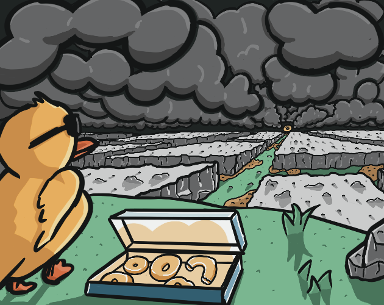
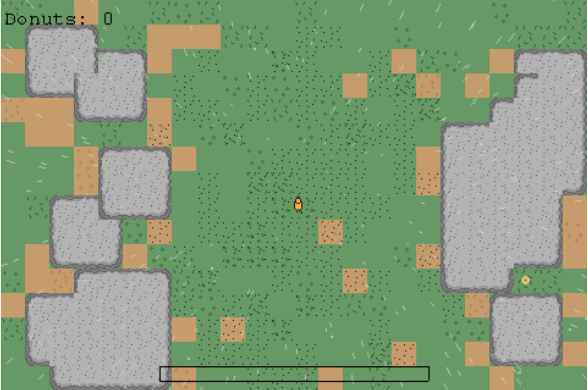
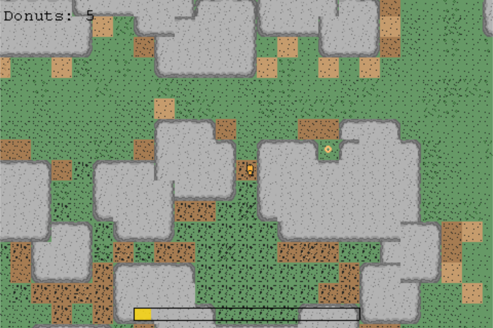

# Acid Rain
This is a game made for the One Lone Coder Codejam 2022. The theme for the codejam was "The Weather."
It uses [sola-game-engine](https://github.com/iamdudeman/sola-game-engine) and the repo template [sola-game-template](https://github.com/iamdudeman/sola-game-template)
was used to start the project.

## Project structure
* [Common game code](game/src)
* [Swing platform code](swing/src)
* [JavaFX platform code](javafx/src)
* [Browser platform code](browser/src)

## Screenshots

