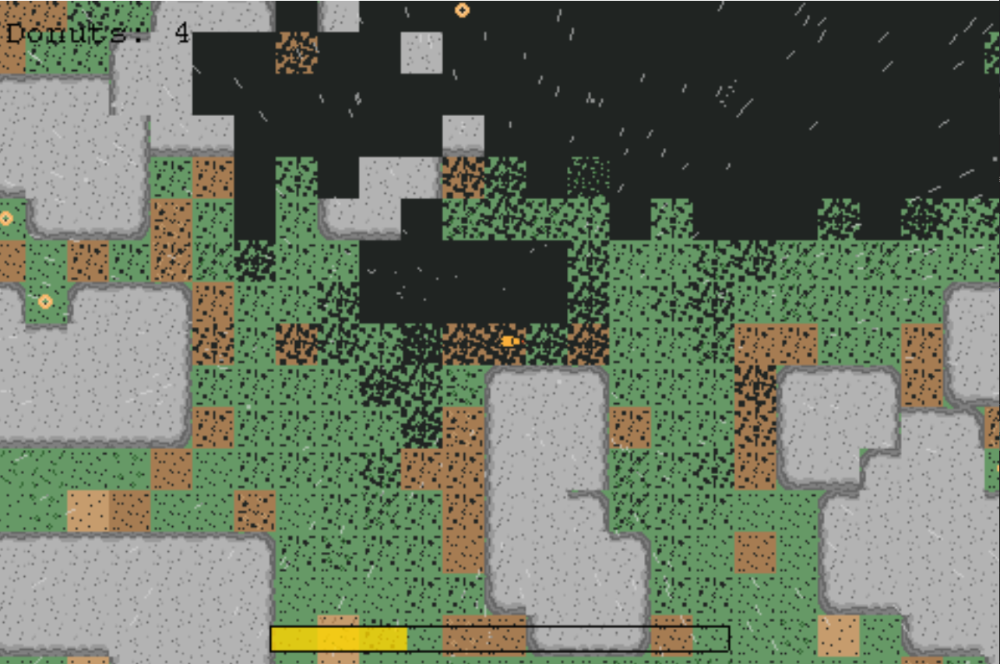
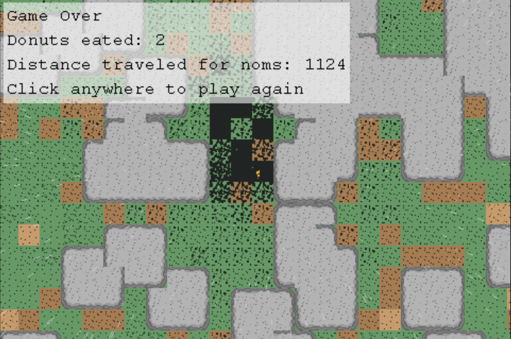

# Acid Rain
This is a game made for the One Lone Coder Codejam 2022. The theme for the codejam was "The Weather."
It uses [sola-game-engine](https://github.com/iamdudeman/sola-game-engine) and the repo template [sola-game-template](https://github.com/iamdudeman/sola-game-template)
was used to start the project.


## Project structure
* [Common game code](game/src)
* [Swing platform code](swing/src)
* [JavaFX platform code](javafx/src)
* [Browser platform code](browser/src)

## Screenshots





## Creating Distributable Games
### Browser zip file
Run the following gradle command
```shell
.\gradlew.bat distWebZip
```
The output will be at `browser/build/<gameName>-browser-<version>.zip`.
This can be deployed to places like `itch.io` when using the "HTML" project type.

### Swing + JavaFx fat jar
Run the following gradle command
```shell
.\gradlew.bat distFatJar
```
The output will be at `swing/build/<gameName>-swing-<version>.jar` and `javafx/build/<gameName>-javafx-<os>-<version>.jar`.
Your users will need to have Java 17 installed to run the jar.

### Swing + JavaFx .exe
You also have the option to use [jpackage](
https://docs.oracle.com/en/java/javase/17/jpackage/packaging-overview.html) to create an executable exe file.
Your users will not need to have Java installed.

1. Install [JDK 17](https://www.oracle.com/java/technologies/javase/jdk17-archive-downloads.html)
2. Update $JAVA_HOME path environment variable
* ex. C:\Program Files\Java\jdk-17.0.5
* To test configuration run: `jpackage --version`
  * Should see the current jdk version returned: `17.0.5`
3. Run the following gradle command
```shell
.\gradlew.bat distFatJarZip
```
4. Output will be in the `build/jpackage` directory
